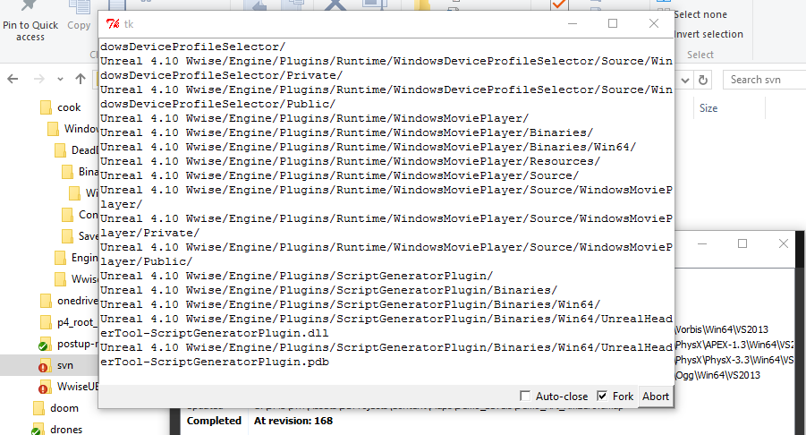
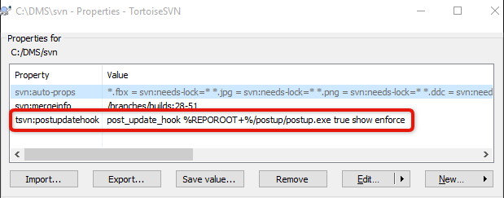

# Introduction

Trigger an rsync update at the end of a TortoiseSVN get or a git checkout, provide a basic TkInter GUI for feedback.

This demonstrates how to configure a post-update client side hook for TortoiseSVN to execute a script of your choice (https://tortoisesvn.net/docs/release/TortoiseSVN_en/tsvn-dug-settings.html#tsvn-dug-settings-hooks). It can also be used with git hooks (https://git-scm.com/docs/githooks).

I use this to synchronize large binary data that does not change often and lives outside of the repository. During implementation there were a number of small gotchas regarding spawning and monitoring of an external process, and providing a basic GUI for feedback so I'm releasing this as a reference.



# Installation

The script should be packaged as a standalone with pyinstaller so it can be executed without needing any dependencies installed on the client system. No python or MSVC runtime needed for the end user, see the pyinstaller section below.

However, you will need to provide your own rsync binary. The free version of cwRsync works: https://www.itefix.net/cwrsync, download it to the cwRsync_5.4.1_x86_Free folder.

For development and packaging you will also need the signalslot library: https://pypi.python.org/pypi/signalslot
```
# svn> /cygdrive/c/Python27/Scripts/pip.exe install weakrefmethod
# svn> /cygdrive/c/Python27/Scripts/pip.exe install signalslot
```
# Unit Tests

Basic tests are provided:

```
ttimo_000@VANGUARD C:/D/tkinter-svn-postup-rsync> /cygdrive/c/Python27/python.exe -m unittest -v postup
test (postup.CallableTest) ... ok
test (postup.ExecutorTest) ... ok
```

# Standalone packaging

Produce a standalone .exe using pyinstaller (http://www.pyinstaller.org/):

```
pyinstaller.exe --windowed -y postup.py
```

# Configuration

Edit the source and change the RSYNC_* variables to suit your needs.

Configure a post commit in TortoiseSVN:


Similar configuration for Git is left as an exercise to the reader.

# Demo mode

If an rsync binary is not provided or misconfigured, the script will run in demo mode and simply ping google for a bit.
